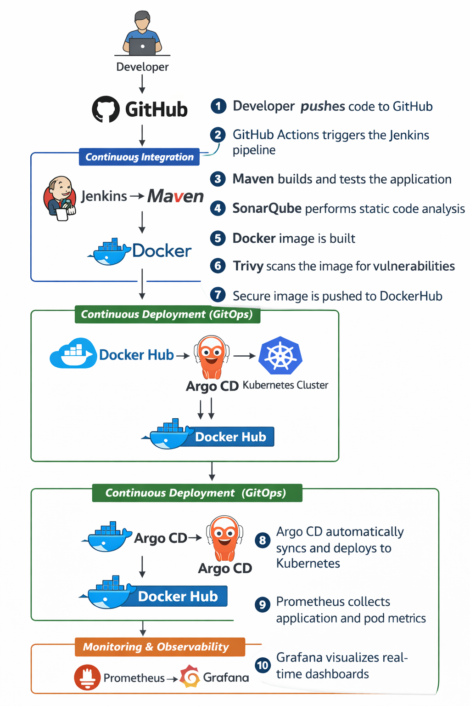
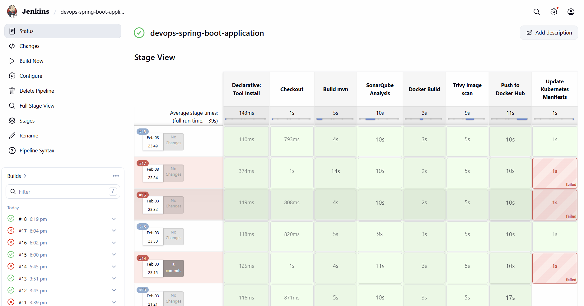
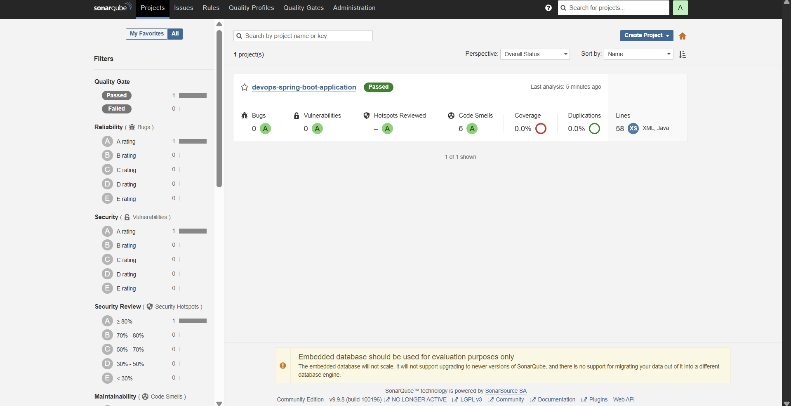
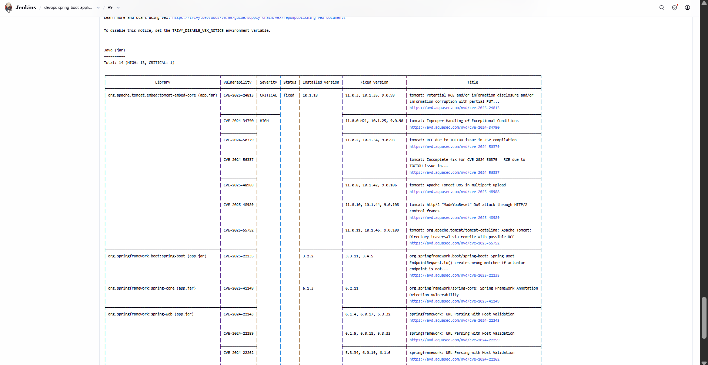
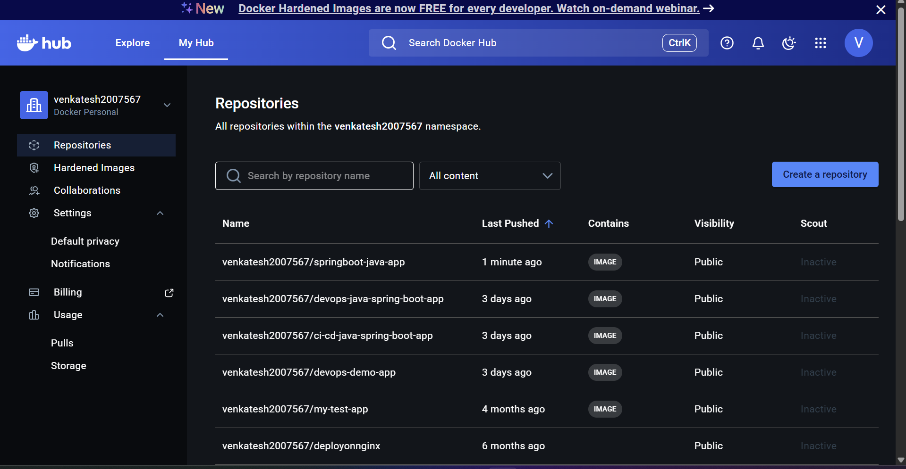
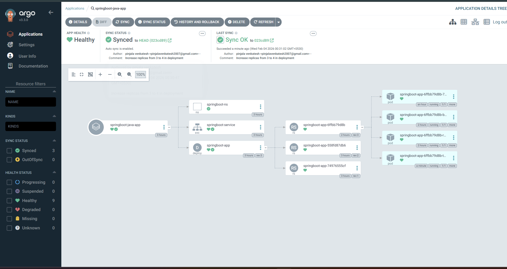
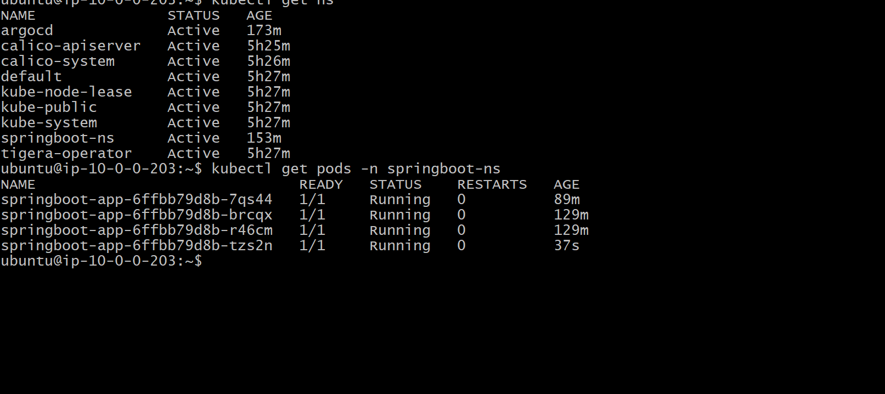
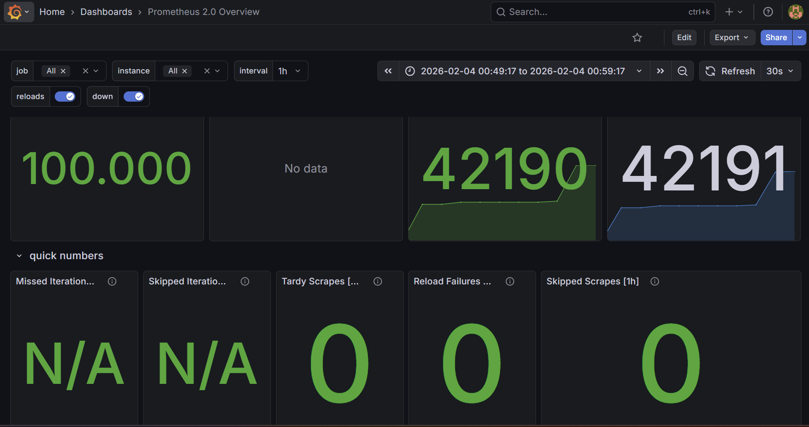

⭐ If you find this project useful, please consider giving it a star!

# 🚀 End-to-End DevSecOps CI/CD Pipeline for Spring Boot on Kubernetes

💡 This project follows real-world production practices including CI/CD automation, DevSecOps security scanning, GitOps deployment, and observability.

---

## 📌 Project Overview

This project demonstrates a **production-ready DevSecOps CI/CD pipeline** for a Spring Boot application.

The pipeline fully automates:

✅ Application build  
✅ Code quality analysis  
✅ Security scanning  
✅ Docker image creation  
✅ GitOps-based Kubernetes deployment  
✅ Monitoring and observability  

Any code change pushed to GitHub is automatically built, scanned, containerized, and deployed to Kubernetes **without manual intervention**.

---

## 🏗️ Architecture

---

## 🛠️ Tech Stack

- **Application:** Spring Boot (Java)  
- **Build Tool:** Maven  
- **CI/CD:** GitHub Actions + Jenkins  
- **Code Quality:** SonarQube  
- **Containerization:** Docker  
- **Security Scanning:** Trivy  
- **Container Registry:** DockerHub  
- **GitOps:** Argo CD  
- **Orchestration:** Kubernetes  
- **Monitoring:** Prometheus & Grafana  

### 🔗 Official Tool Links

- Jenkins → https://www.jenkins.io/  
- Docker → https://www.docker.com/  
- Kubernetes → https://kubernetes.io/  
- Argo CD → https://argo-cd.readthedocs.io/  
- Prometheus → https://prometheus.io/  
- Grafana → https://grafana.com/  

---

## 🔄 CI/CD Workflow

1️⃣ Developer pushes code to **GitHub**  
2️⃣ **GitHub Actions** triggers the Jenkins pipeline  
3️⃣ **Maven** builds and tests the application  
4️⃣ **SonarQube** performs static code analysis  
5️⃣ **Docker** image is built  
6️⃣ **Trivy** scans the image for vulnerabilities  
7️⃣ Secure image is pushed to **DockerHub**  
8️⃣ **Argo CD** automatically syncs and deploys to Kubernetes  
9️⃣ **Prometheus** collects application and pod metrics  
🔟 **Grafana** visualizes real-time dashboards  

✅ Result: **Fully automated, secure, production-style deployment pipeline**

---

## 📸 Project Proof / Screenshots

### ✅ Jenkins Pipeline Success

### ✅ SonarQube Quality Gate

### ✅ Trivy Vulnerability Scan

### ✅ DockerHub Repository

### ✅ Argo CD Sync Status

### ✅ Kubernetes Running Pods

### ✅ Grafana Monitoring Dashboard

---

## 🚀 Key Features

✔ Fully automated CI/CD pipeline  
✔ DevSecOps implementation with SonarQube & Trivy  
✔ GitOps-based deployment using Argo CD  
✔ Containerized microservice deployment  
✔ Kubernetes orchestration  
✔ Automated vulnerability scanning  
✔ Real-time monitoring and alert-ready architecture  
✔ Production-style workflow  

---

## 🧠 Key Learnings

- Designed and implemented an end-to-end CI/CD pipeline  
- Gained hands-on experience with **GitOps deployment**  
- Integrated **security into CI/CD (DevSecOps)**  
- Deployed scalable applications on Kubernetes  
- Configured production-grade monitoring with Prometheus & Grafana  
- Improved troubleshooting and pipeline optimization skills  

---

## 👨‍💻 Author

**Venkatesh Pinjala**  
DevOps Engineer | Kubernetes | CI/CD | Cloud | Automation
